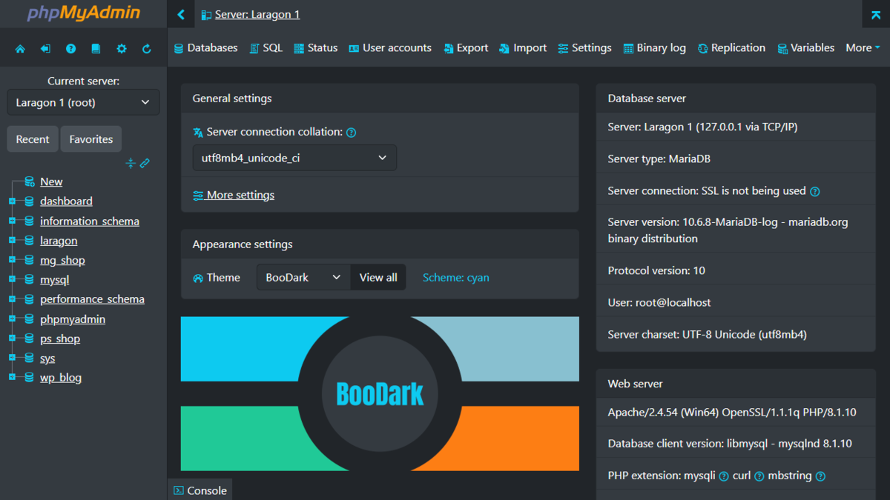

# BooDark



[](https://github.com/adorade/boodark/blob/main/package.json)
[](https://mit-license.org)
[](https://github.com/adorade/boodark/actions/workflows/node.yml)

> Bootstrap Dark theme for phpMyAdmin

- Supported versions: 5.2
- Bootstrap v5.2.3

## Changes

- Background color changed: shades of gray & black
- Fonts color changed: shades of white & light gray
- Default SQL Query editor color theme changed
- jQuery UI improved: ui-darkness
- Designer adjusted for dark theme
- Console adjusted for dark theme
- Inline SVG using `escape-svg` function
- Color Schemes: `cyan` (main), `teal`, `nord` and `orange`

## Demo

The best way to see **BooDark** in action is to try it on **phpMyAdmin** demo server.

- Navigate to [phpMyAdmin demo server](https://demo.phpmyadmin.net/QA_5_2/)
- Login is root with empty password
- Go to **Appearance settings > Themes** and choose **BooDark**.

## Installation

1. Download latest [release](https://github.com/adorade/boodark/releases/latest/download/boodark-v1.1.1.zip)
2. Extract the archive files
3. Go to the phpMyAdmin files (C:\xampp\phpmyadmin for XAMPP) then go to the `themes` folder and add here the `boodark` folder
4. Select `BooDark` theme on the home page

## Building

BooDark theme respects the folders structure of phpMyAdmin.

```txt
├── node_modules
├── themes
│   └── boodark
│       ├── css/
│       ├── img/
│       ├── jquery/
│       ├── scss/
│       ├── screen.png
│       └── theme.json
├── package.json
└── yarn.lock
```

To build the theme or customize it with your preferences you must have **Node**, **Yarn** and **Git** installed. Then follow step by step:

1. Open your command-line and navigate to your projects folder
2. Clone this repo locally: `git clone https://github.com/adorade/boodark .`
3. Install project dependecies: `yarn install`
4. Do any modifications you want (eg. change color scheme)
5. Compile `scss` files to `css`

    ```sh
    # production, minified files
    yarn run build
    # development
    yarn run build:dev
    ```

6. Theme files are in `themes/boodark`.

## Color Schemes

BooDark has several color schemes: `cyan` (main), `teal`, `nord` and `orange`.  
**There is currently no way to change the color scheme in GUI.**

**How to change color scheme?**

Option 1. Edit `scss/_variables.scss` (see [Building](#building))

```scss
// Theme color scheme
// Values: "cyan", "teal", "nord", "orange"
// Default: "cyan"
// Set this value for the desired color scheme

// --- Change cyan
$color-scheme: cyan !default;

// --- to nord
$color-scheme: nord !default;

// --- then run `yarn run build`
```

Option 2. Replace the CSS files. For example:

```sh
mv themes/boodark/css/theme.css themes/boodark/css/theme-cyan.css
mv themes/boodark/css/theme-nord.css themes/boodark/css/theme.css
```

## Bugs and feature requests

Have a bug or a feature request? Please search for existing and closed issues.
If your problem or idea is not addressed yet, [please open a new issue](https://github.com/adorade/boodark/issues/new).

## License

BooDark Theme is licensed under [MIT](LICENSE).  
Copyright (c) 2022-23 [Adorade](https://github.com/adorade)

## Thanks for use

Hopefully, this theme is useful to you.
